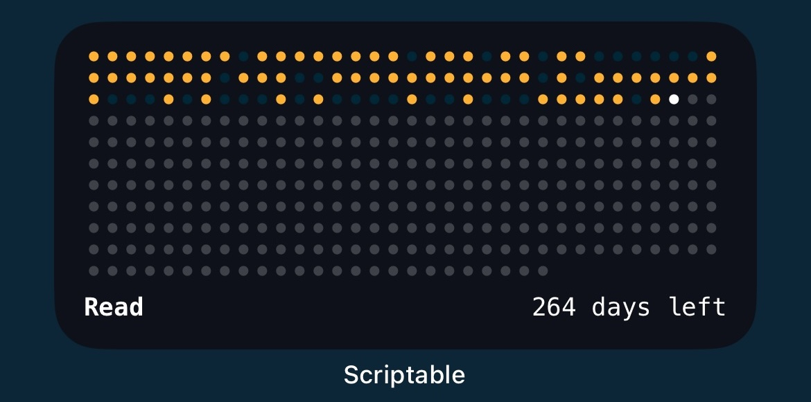

# Scriptable Habit Tracker
A Scriptable widget for visualizing habit tracking data as a heatmap, featuring a streak counter (current/max streak) and a tracker for the total number of completed habits versus the total planned.

  

## Setup and Installation
1. Install **Scriptable** from the App Store
2. **Create a new script** and paste the code provided in the [script](script.js) file
3. Modify the _user configuration_ section in the script to set your habit name, start and end dates, and, if you want, different styles
4. Add the widget to your home screen with medium size and start to track your habit
